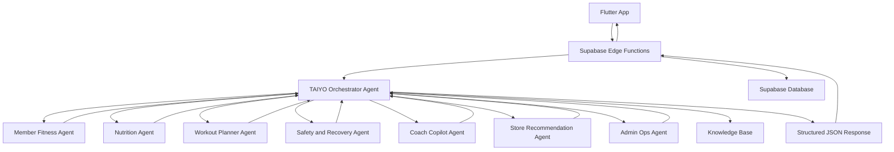

# 🏋️ GymUnity TAIYO AI Agent System

TAIYO is a multi-agent AI system designed for **GymUnity**, a fitness platform that connects members, coaches, sellers, and admin operations.

The goal of this project is to explore how AI can support a fitness app beyond a basic chatbot by using specialized agents, safety rules, knowledge grounding, and structured outputs.

> Current status: Azure AI Foundry agent system MVP completed and tested with sample scenarios. Supabase and Flutter integration are planned as the next phases.

---

## 📌 Project Idea

Most fitness apps use AI as a simple chat feature.

In this project, TAIYO is designed as a more structured AI layer that can help with:

- Daily member fitness guidance
- Nutrition support
- Workout plan drafting
- Safety and recovery checks
- Coach client summaries
- Store product recommendations
- Admin and payment-operation support

The system is built around an Orchestrator Agent that routes each request to the most relevant specialized agent.

---

## 🧠 System Architecture



---

## 🤖 Agents

### TAIYO Orchestrator Agent

The Orchestrator is the main coordinator of the system.

It is responsible for:

- Understanding the request type
- Selecting the right specialized agent or agents
- Applying routing and safety rules
- Returning a structured JSON response

### Specialized Agents

The system currently includes:

| Agent | Purpose |
| --- | --- |
| **Member Fitness Agent** | Generates daily fitness recommendations based on member context |
| **Nutrition Agent** | Provides general nutrition guidance based on goals and logs |
| **Workout Planner Agent** | Drafts workout plan structures and adjustments |
| **Safety and Recovery Agent** | Reviews risky cases and prevents unsafe recommendations |
| **Coach Copilot Agent** | Helps coaches understand client status with privacy checks |
| **Store Recommendation Agent** | Suggests products based on fitness context and catalog availability |
| **Admin Ops Agent** | Helps explain payment, subscription, and operational issues |

---

## 📚 Knowledge Grounding

TAIYO uses a knowledge base to keep the agents aligned with GymUnity rules.

The knowledge base includes:

- Fitness safety rules
- Training adjustment rules
- Nutrition guidance
- Workout planning rules
- Coach Copilot rules
- Store recommendation rules
- Admin Ops rules
- GymUnity app FAQ
- Orchestrator routing notes

The knowledge base is used for static rules only. Live user data will come from Supabase.

---

## 🔐 Data Flow

The planned production flow is:

```text
Flutter App
→ Supabase Edge Function
→ Azure AI Foundry Orchestrator
→ Specialized Agents
→ Structured JSON Response
→ Flutter UI Cards
```

Flutter will not call Azure directly.

Supabase is responsible for:

- Authentication
- Role checks
- Privacy rules
- Context building
- Database access
- Logging and rate limiting

Azure AI Foundry is responsible for:

- Agent reasoning
- Routing
- Knowledge grounding
- Safety-aware responses
- Structured output generation

---

## ✅ Current Progress

Completed so far:

- Azure AI Foundry project created
- Model deployment configured
- TAIYO Orchestrator Agent created
- Specialized agents created
- Connected agents added to the Orchestrator
- Knowledge base uploaded
- Routing rules tested
- Safety cases tested
- Store catalog-missing behavior tested
- Coach visibility-permission behavior tested
- Admin payment-risk case tested
- JSON response structure tested

This is currently an AI architecture MVP, not a fully deployed production system yet.

---

## 🧪 Tested Scenarios

### 1. Store Recommendation Without Product Catalog

When the product catalog is missing, the system should not invent products.

Expected behavior:

```json
{
  "status": "needs_catalog_context",
  "required_context": ["product_catalog"],
  "result": {
    "products": []
  }
}
```

---

### 2. Coach Client Brief Without Visibility Permission

When coach visibility permission is not confirmed, the system should not summarize private client data.

Expected behavior:

```json
{
  "status": "needs_visibility_permission",
  "required_context": ["visibility_permission"]
}
```

---

### 3. Safety Red Flag Case

For symptoms such as chest pain and dizziness, the system should block training recommendations and escalate the case.

Expected behavior:

```json
{
  "status": "blocked_for_safety",
  "risk_level": "high"
}
```

---

### 4. Admin Ops Payment Risk Case

For a successful payment where the subscription is still not active, the system should recommend admin reconciliation.

Expected behavior:

```json
{
  "risk_level": "high",
  "primary_recommendation": "admin_reconcile_payment_order"
}
```

---

## 🛠️ Tech Stack

- Azure AI Foundry
- Azure AI Agents
- GPT-4o deployment
- Knowledge / File Search
- Supabase
- Supabase Edge Functions
- Flutter
- JSON structured outputs

---

## 🗺️ Roadmap

### Phase 1 — Azure AI Foundry Agent System

Status: Completed as MVP.

### Phase 2 — Supabase Context Builder Design

Define what live data each agent needs and map it to Supabase tables and RPCs.

### Phase 3 — Supabase Edge Functions

Build secure backend functions that prepare user context and call Azure.

### Phase 4 — Azure Actions / OpenAPI Tools

Allow Azure agents to call Supabase context functions when needed.

### Phase 5 — Flutter Integration

Render TAIYO responses inside the GymUnity app using clean UI cards.

### Phase 6 — Evaluation and Demo

Prepare test cases, screenshots, demo flows, and graduation-project presentation material.

---

## 🎯 Project Goal

The goal of TAIYO is to demonstrate how a fitness app can use a multi-agent AI architecture in a practical and safe way.

Instead of relying on one general chatbot, the system separates responsibilities between specialized agents and uses structured outputs that can later be connected to Supabase and Flutter.
