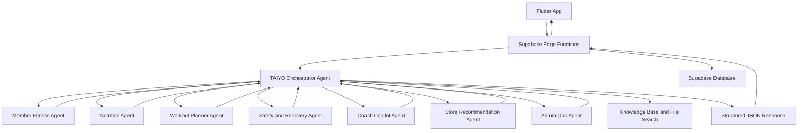

# GymUnity TAIYO AI Agent System

TAIYO is a multi-agent AI system built for **GymUnity** using **Azure AI Foundry**.

The goal of this project is to move beyond a basic chatbot and design a structured AI operating layer for fitness, coaching, nutrition, store recommendations, safety, and admin operations.

---

## Project Overview

GymUnity is a multi-role fitness platform that includes members, coaches, sellers, and admin operations.

TAIYO is designed as an AI layer that can:

- Generate daily member fitness briefs
- Provide nutrition guidance
- Draft workout plans
- Review recommendations for safety
- Help coaches summarize client status
- Recommend store products based on member context
- Assist admins with payment and operational issues

---

## Architecture



---

## Main Components

### 1. TAIYO Orchestrator Agent

The Orchestrator is responsible for understanding the request, selecting the correct specialized agents, applying routing rules, and returning one final structured JSON response.

### 2. Specialized Agents

The system includes the following agents:

- TAIYO Member Fitness Agent
- TAIYO Nutrition Agent
- TAIYO Workout Planner Agent
- TAIYO Safety and Recovery Agent
- TAIYO Coach Copilot Agent
- TAIYO Store Recommendation Agent
- TAIYO Admin Ops Agent

### 3. Knowledge Grounding

The Orchestrator uses a knowledge base that includes:

- Safety rules
- Training rules
- Nutrition guidance
- Workout planning rules
- Coach Copilot rules
- Store recommendation rules
- Admin Ops rules
- GymUnity app FAQ
- Orchestrator routing cheatsheet

### 4. Supabase Context Layer

Supabase will provide live user data to the agents through secure Edge Functions.

Examples of live data:

- Member readiness
- Sleep
- Workout history
- Nutrition logs
- Hydration logs
- Coach visibility settings
- Product catalog
- Payment and subscription status

### 5. Flutter UI Layer

Flutter will not call Azure directly.

The planned production flow is:

```text
Flutter App
→ Supabase Edge Function
→ Azure AI Foundry Orchestrator
→ Specialized Agents
→ Structured JSON Response
→ Flutter UI Cards
```

---

## Current Status

The Azure AI Foundry MVP has been completed.

Completed work:

- Azure AI Foundry project created
- Model deployment created
- Orchestrator Agent created
- Specialized agents created
- Connected agents configured
- Knowledge base uploaded
- Safety and routing rules tested
- Store missing-catalog behavior tested
- Coach visibility permission behavior tested
- Admin Ops payment-risk logic tested
- Structured JSON output tested

---

## Tested Scenarios

### Store Recommendation Without Product Catalog

Expected behavior:

```json
{
  "status": "needs_catalog_context",
  "required_context": ["product_catalog"],
  "result": {
    "products": []
  }
}
```

### Coach Client Brief Without Visibility Permission

Expected behavior:

```json
{
  "status": "needs_visibility_permission",
  "required_context": ["visibility_permission"]
}
```

### Safety Red Flag Case

For symptoms such as chest pain and dizziness, TAIYO should block training recommendations and escalate the case as high risk.

Expected behavior:

```json
{
  "status": "blocked_for_safety",
  "risk_level": "high"
}
```

### Admin Ops Payment Risk Case

For a paid Paymob transaction with a subscription still in `checkout_pending`, TAIYO recommends admin reconciliation.

Expected behavior:

```json
{
  "risk_level": "high",
  "primary_recommendation": "admin_reconcile_payment_order"
}
```

---

## Tech Stack

- Azure AI Foundry
- GPT-4o deployment
- Azure AI Agents
- Knowledge and File Search
- Supabase
- Supabase Edge Functions
- Flutter
- JSON structured outputs

---

## Roadmap

### Phase 1 — Azure AI Foundry Agent System

Status: Completed as MVP.

### Phase 2 — Supabase Context Builder Design

Next step.

Goal: define exactly what live data each agent needs and map it to Supabase tables and RPCs.

### Phase 3 — Supabase Edge Functions

Goal: build secure backend functions that prepare context and call Azure.

### Phase 4 — Azure Actions and OpenAPI Tools

Goal: allow Azure agents to call Supabase context functions.

### Phase 5 — Flutter Integration

Goal: display TAIYO responses inside GymUnity as clean UI cards.

### Phase 6 — Evaluation and Demo Preparation

Goal: create test cases, screenshots, and a final graduation-project demo.

---

## Important Security Notes

This repository does not include:

- Azure API keys
- Supabase service role keys
- Paymob secrets
- Private user data
- Real member or coach records

All sensitive values should be stored in environment variables or secure backend secrets.

---

## Project Goal

The goal of TAIYO is to demonstrate how a fitness application can use a multi-agent AI architecture instead of a basic chatbot.

TAIYO is designed to act as a secure, structured, and privacy-aware AI operating layer inside GymUnity.
