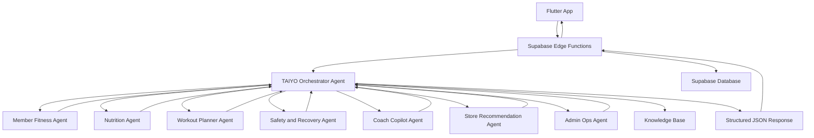

# 🧠 TAIYO System Architecture

This document explains the high-level architecture of the **TAIYO AI Agent System** inside GymUnity.

TAIYO is designed as a multi-agent AI layer. It does not replace the app backend or UI. Instead, it works as an intelligence layer between Supabase and the user-facing Flutter screens.

---

## 1. Architecture Overview

The planned system follows this flow:



---

## 2. Responsibility Split

### Azure AI Foundry

Azure AI Foundry is responsible for the intelligence layer.

It handles:

- Agent orchestration
- Routing between specialized agents
- Knowledge-grounded reasoning
- Safety-aware decision making
- Structured JSON output generation

### Supabase

Supabase is responsible for live data and backend security.

It handles:

- Authentication
- Role checks
- Row-level security
- Context building
- Database access
- Logging
- Rate limiting
- Secure Edge Functions

### Flutter

Flutter is responsible for the user interface.

It handles:

- Displaying TAIYO cards
- Showing loading and error states
- Rendering recommendations
- Sending user actions to Supabase
- Avoiding direct access to Azure secrets

---

## 3. Why Flutter Should Not Call Azure Directly

Flutter should not communicate with Azure AI Foundry directly.

Reasons:

- Azure credentials must not be stored inside the mobile app
- Supabase needs to verify the authenticated user
- Role and permission checks must happen before calling AI
- Coach visibility rules must be enforced before exposing client data
- AI responses should be logged and monitored safely
- Rate limits should be controlled from the backend

The safer flow is:

```text
Flutter App
→ Supabase Edge Function
→ Azure AI Foundry
→ Supabase Edge Function
→ Flutter App
```

---

## 4. Orchestrator Role

The **TAIYO Orchestrator Agent** acts as the main coordinator.

Its responsibilities include:

- Understanding the request type
- Selecting the correct specialized agent
- Combining outputs when more than one agent is needed
- Applying safety and privacy rules
- Returning one final JSON response

Example request types:

- `daily_member_brief`
- `workout_plan_draft`
- `coach_client_brief`
- `store_recommendation`
- `admin_ops_brief`

---

## 5. Specialized Agents

| Agent | Main Responsibility |
| --- | --- |
| Member Fitness Agent | Daily training guidance and readiness-based recommendations |
| Nutrition Agent | General nutrition and hydration guidance |
| Workout Planner Agent | Drafting workout structures and training adjustments |
| Safety and Recovery Agent | Reviewing risks, red flags, pain, fatigue, and recovery needs |
| Coach Copilot Agent | Producing privacy-aware client summaries for coaches |
| Store Recommendation Agent | Recommending products only when a valid catalog is provided |
| Admin Ops Agent | Explaining payment, subscription, payout, and operational issues |

---

## 6. Knowledge vs Live Data

TAIYO separates static knowledge from live user data.

### Static Knowledge

Static knowledge belongs in Azure AI Foundry Knowledge.

Examples:

- Fitness safety rules
- Training logic
- Nutrition guidance
- Workout planning rules
- Coach Copilot rules
- Store recommendation boundaries
- GymUnity app FAQ

### Live Data

Live data belongs in Supabase.

Examples:

- Member readiness
- Sleep logs
- Meal logs
- Hydration logs
- Workout history
- Coach visibility settings
- Product catalog
- Payment orders
- Subscription status

This separation helps keep the system safer, cleaner, and easier to maintain.

---

## 7. Planned Production Flow

Example: Daily Member Brief

```text
1. Member opens the GymUnity app.
2. Flutter calls a Supabase Edge Function.
3. Supabase verifies the user and builds the member context.
4. Supabase sends the context to the TAIYO Orchestrator Agent.
5. The Orchestrator routes the request to the relevant agents.
6. Safety and knowledge rules are applied.
7. Azure returns a structured JSON response.
8. Supabase logs the result and returns it to Flutter.
9. Flutter displays the result as clean UI cards.
```

---

## 8. Current Implementation Status

Completed:

- Azure AI Foundry project created
- Model deployment configured
- Orchestrator Agent created
- Specialized agents created
- Connected agents configured
- Knowledge base uploaded
- Manual test cases completed
- Safety and routing behaviors validated with sample data

Next phase:

- Design Supabase context schemas
- Map context fields to Supabase tables and RPCs
- Build Supabase Edge Functions
- Connect Azure and Supabase through secure backend calls
- Render responses in Flutter

---

## 9. Design Principle

The main design principle is simple:

```text
Azure AI Foundry = intelligence and reasoning
Supabase = data, security, and context
Flutter = user interface
```

TAIYO is designed to connect these layers without mixing their responsibilities.
