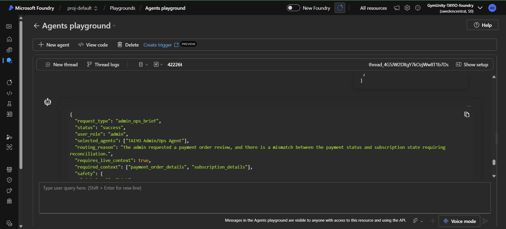
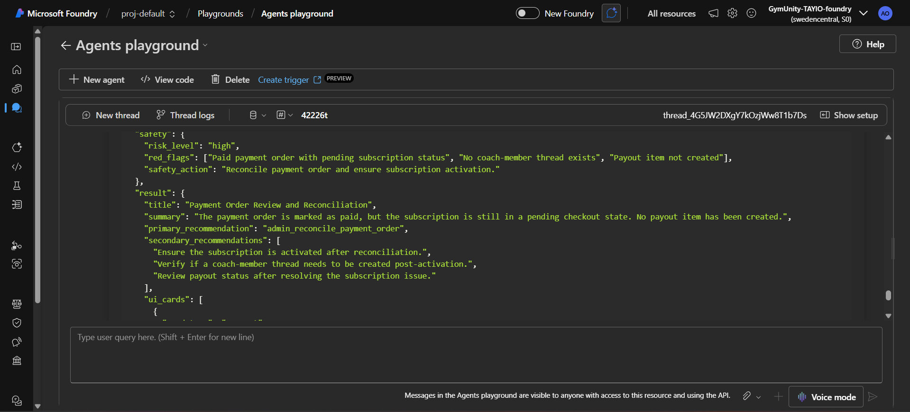
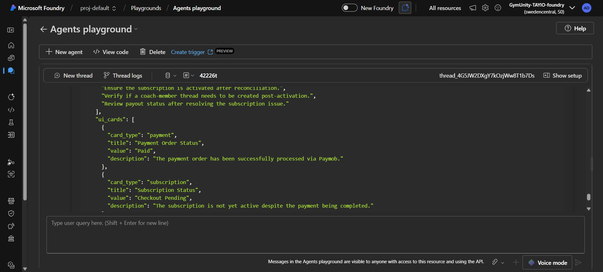
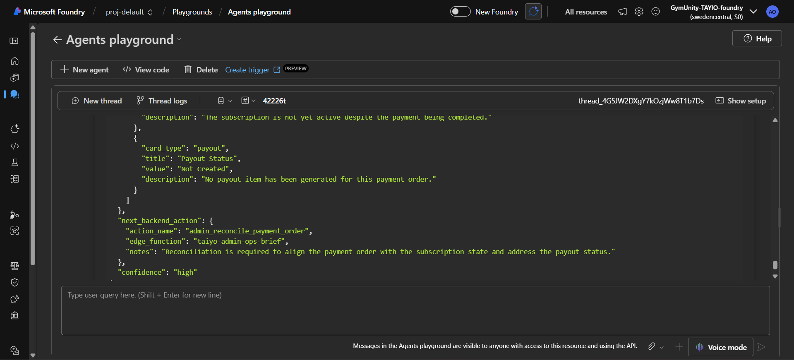
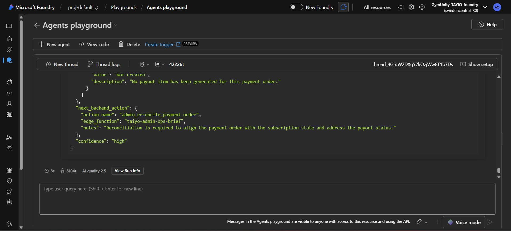

# Test Case: Admin/Ops Brief - Paid Payment But Subscription Not Active

## Purpose

This test validates that the TAIYO Orchestrator can detect an operational payment/subscription mismatch and recommend the correct admin action.

The expected behavior is that the system should identify that the payment is paid, but the subscription is still not active, then recommend reconciliation without exposing sensitive payment data.

## Agent Tested

TAIYO Orchestrator Agent

## Scenario

An admin reviews a Paymob payment order. The payment order is marked as paid and the latest transaction succeeded, but the related subscription is still `checkout_pending`.

There is also no coach-member thread and no payout item created.

This test checks whether the Orchestrator correctly applies the Admin/Ops rules:

- Detect paid payment with inactive subscription.
- Treat the issue as high risk.
- Recommend the exact admin action `admin_reconcile_payment_order`.
- Avoid exposing payment secrets or raw provider payloads.
- Return an admin-friendly structured response.

## Input Prompt

```json
{
  "request_type": "admin_ops_brief",
  "user_role": "admin",
  "admin_context": {
    "admin_id": "admin_demo_001",
    "admin_role": "finance_admin",
    "requested_view": "payment_order_review"
  },
  "payment_context": {
    "payment_order_id": "pay_order_demo_001",
    "payment_order_status": "paid",
    "payment_provider": "paymob",
    "payment_amount": 1500,
    "payment_currency": "EGP",
    "latest_transaction_status": "success",
    "hmac_verified": true
  },
  "subscription_context": {
    "subscription_id": "sub_demo_001",
    "subscription_status": "checkout_pending",
    "checkout_status": "pending",
    "coach_member_thread_exists": false
  },
  "payout_context": {
    "payout_item_exists": false,
    "payout_status": "not_created"
  },
  "security_constraints": {
    "do_not_expose_raw_provider_payload": true,
    "do_not_expose_payment_secrets": true
  }
}
```

## Expected Behavior

- `status` should be `success`
- `risk_level` should be `high`
- Selected agents should include `TAIYO Admin/Ops Agent`
- The issue should be identified as a paid payment with inactive subscription
- The primary recommendation should be `admin_reconcile_payment_order`
- The response should mention that the subscription is still pending
- The response should mention that no coach-member thread exists
- The response should mention that no payout item has been created
- No payment secrets should be exposed
- No raw payment provider payload should be exposed

## Actual Azure Response

```json
{
  "request_type": "admin_ops_brief",
  "status": "success",
  "user_role": "admin",
  "selected_agents": ["TAIYO Admin/Ops Agent"],
  "routing_reason": "The admin requested a payment order review, and there is a mismatch between the payment status and subscription state requiring reconciliation.",
  "requires_live_context": true,
  "required_context": ["payment_order_details", "subscription_details"],
  "safety": {
    "risk_level": "high",
    "red_flags": ["Paid payment order with pending subscription status", "No coach-member thread exists", "Payout item not created"],
    "safety_action": "Reconcile payment order and ensure subscription activation."
  },
  "result": {
    "title": "Payment Order Review and Reconciliation",
    "summary": "The payment order is marked as paid, but the subscription is still in a pending checkout state. No payout item has been created.",
    "primary_recommendation": "admin_reconcile_payment_order",
    "secondary_recommendations": [
      "Ensure the subscription is activated after reconciliation.",
      "Verify if a coach-member thread needs to be created post-activation.",
      "Review payout status after resolving the subscription issue."
    ],
    "ui_cards": [
      {
        "card_type": "payment",
        "title": "Payment Order Status",
        "value": "Paid",
        "description": "The payment order has been successfully processed via Paymob."
      },
      {
        "card_type": "subscription",
        "title": "Subscription Status",
        "value": "Checkout Pending",
        "description": "The subscription is not yet active despite the payment being completed."
      },
      {
        "card_type": "payout",
        "title": "Payout Status",
        "value": "Not Created",
        "description": "No payout item has been generated for this payment order."
      }
    ]
  },
  "next_backend_action": {
    "action_name": "admin_reconcile_payment_order",
    "edge_function": "taiyo-admin-ops-brief",
    "notes": "Reconciliation is required to align the payment order with the subscription state and address the payout status."
  },
  "confidence": "high"
}
```

## Screenshot Evidence

### Screenshot 1 - Input Prompt



### Screenshot 2 - Azure Response



### Screenshot 3 - Test Evidence



### Screenshot 4 - Test Evidence



### Screenshot 5 - Test Evidence



## Result

Passed

## Notes

The Orchestrator correctly detected the mismatch between a paid Paymob payment order and a subscription that was still in `checkout_pending`.

The response marked the case as high risk and recommended the exact admin action `admin_reconcile_payment_order`.

No payment secrets or raw provider payloads were exposed.
