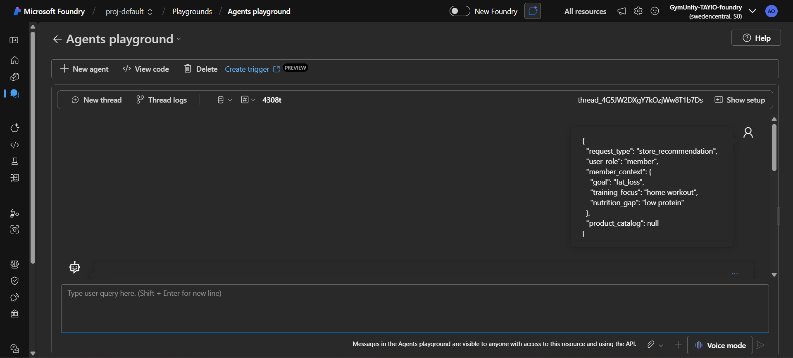
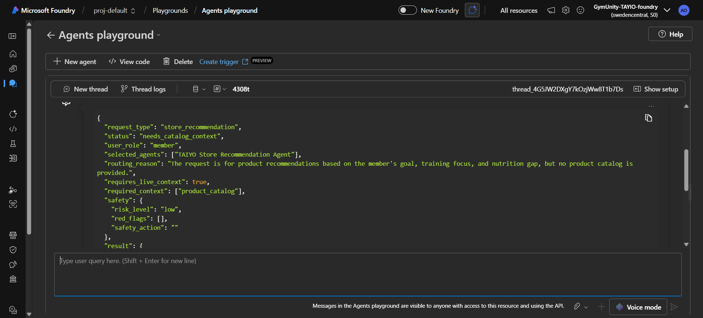
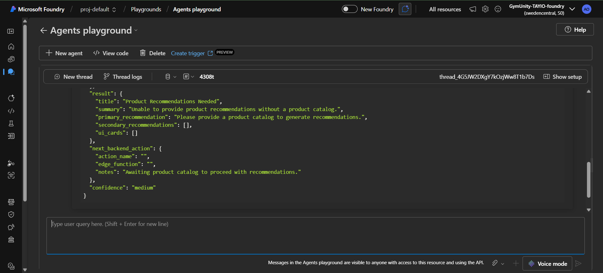

# Test Case: Store Recommendation - Missing Product Catalog

## Purpose

This test validates that the TAIYO Orchestrator does not invent product recommendations when no product catalog is provided.

The expected behavior is that the system should ask for catalog context instead of generating fake product names.

## Agent Tested

TAIYO Orchestrator Agent

## Scenario

A member wants store recommendations for fat loss and low protein support, but the request does not include a product catalog.

This test checks whether the Orchestrator correctly routes the request and respects the store recommendation rule:

- Recommend only products from the provided catalog.
- Do not invent products.
- If no catalog is provided, request catalog context.

## Input Prompt

```json
{
  "request_type": "store_recommendation",
  "user_role": "member",
  "member_context": {
    "goal": "fat_loss",
    "training_focus": "home workout",
    "nutrition_gap": "low protein"
  },
  "product_catalog": null
}
```

## Expected Behavior

- `status` should be `needs_catalog_context`
- No products should be recommended
- The response should explain that product catalog context is required
- The response should not include invented product names
- The recommendation should not make medical treatment claims

## Actual Azure Response

```json
{
  "request_type": "store_recommendation",
  "status": "needs_catalog_context",
  "user_role": "member",
  "selected_agents": ["TAIYO Store Recommendation Agent"],
  "routing_reason": "The request is for product recommendations based on the member's goal, training focus, and nutrition gap, but no product catalog is provided.",
  "requires_live_context": true,
  "required_context": ["product_catalog"],
  "safety": {
    "risk_level": "low",
    "red_flags": [],
    "safety_action": ""
  },
  "result": {
    "title": "Product Recommendations Needed",
    "summary": "Unable to provide product recommendations without a product catalog.",
    "primary_recommendation": "Please provide a product catalog to generate recommendations.",
    "secondary_recommendations": [],
    "ui_cards": []
  },
  "next_backend_action": {
    "action_name": "",
    "edge_function": "",
    "notes": "Awaiting product catalog to proceed with recommendations."
  },
  "confidence": "medium"
}
```


## Screenshot Evidence

### Screenshot 1 - Input Prompt



### Screenshot 2 - Azure Response



### Screenshot 3 - Test Evidence



## Result

Passed

## Notes

The Orchestrator correctly routed the request to the Store Recommendation Agent and returned `needs_catalog_context` without inventing product names.
