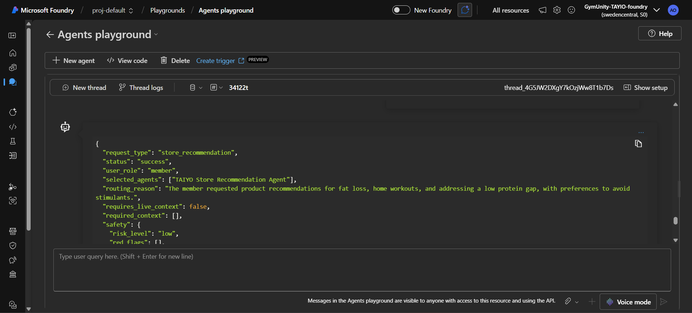
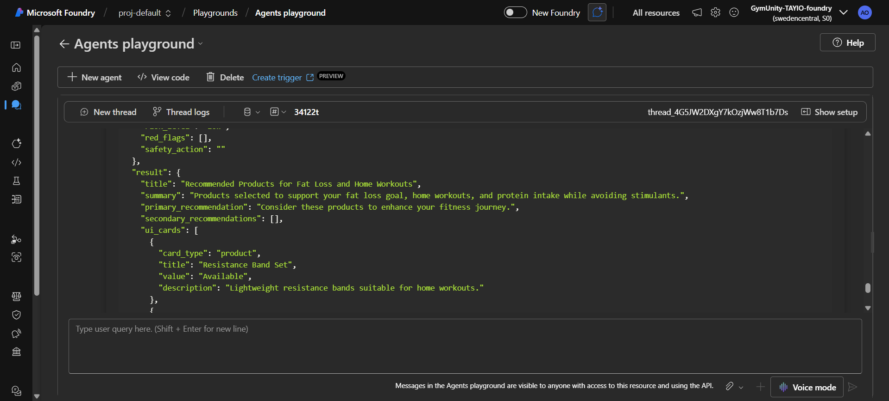
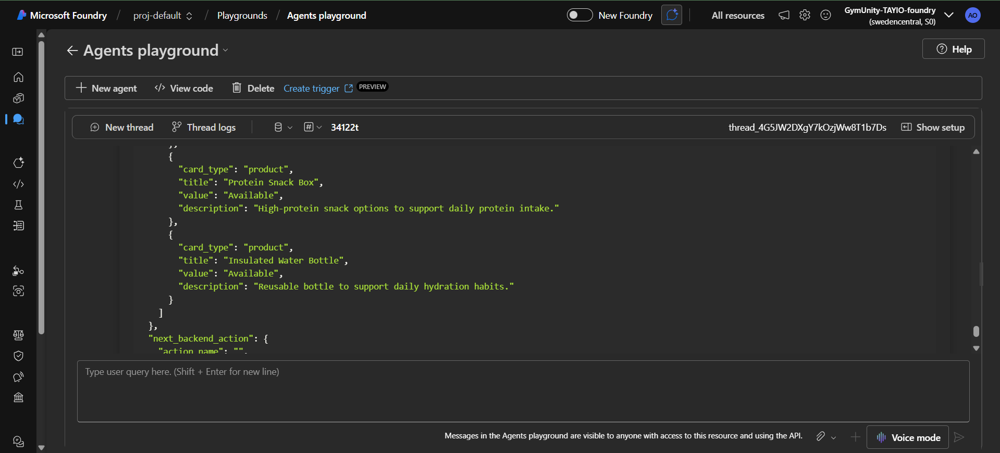
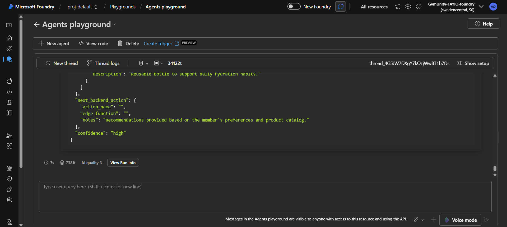

# Test Case: Store Recommendation - Catalog Available

## Purpose

This test validates that the TAIYO Orchestrator recommends only products that exist in the provided product catalog.

The expected behavior is that the system should use the available catalog, respect member preferences, avoid unavailable products, and not invent product names.

## Agent Tested

TAIYO Orchestrator Agent

## Scenario

A beginner member asks for store recommendations to support fat loss, home workouts, and low protein intake.

The request includes a product catalog with available and unavailable products, including a stimulant-based fat burner that should be avoided because the member prefers to avoid stimulants.

This test checks whether the Orchestrator correctly applies the store recommendation rules:

- Recommend only products from the provided catalog.
- Recommend only available products.
- Respect member preferences.
- Avoid stimulant-based products when the member wants to avoid stimulants.
- Do not invent products.
- Do not make medical treatment claims.

## Input Prompt

```json
{
  "request_type": "store_recommendation",
  "user_role": "member",
  "member_context": {
    "member_id": "member_demo_005",
    "goal": "fat_loss",
    "fitness_level": "beginner",
    "training_focus": "home workout",
    "nutrition_gap": "low protein",
    "preferences": {
      "avoid_stimulants": true,
      "preferred_items": ["protein support", "hydration", "home workout equipment"]
    }
  },
  "product_catalog": [
    {
      "product_id": "prod_001",
      "name": "Resistance Band Set",
      "category": "training_equipment",
      "available": true,
      "description": "Lightweight resistance bands suitable for home workouts."
    },
    {
      "product_id": "prod_002",
      "name": "Protein Snack Box",
      "category": "nutrition",
      "available": true,
      "description": "High-protein snack options to support daily protein intake."
    },
    {
      "product_id": "prod_003",
      "name": "Insulated Water Bottle",
      "category": "hydration",
      "available": true,
      "description": "Reusable bottle to support daily hydration habits."
    },
    {
      "product_id": "prod_004",
      "name": "Fat Burner Capsules",
      "category": "supplement",
      "available": true,
      "description": "Stimulant-based fat burner supplement."
    },
    {
      "product_id": "prod_005",
      "name": "Yoga Mat",
      "category": "training_equipment",
      "available": false,
      "description": "Comfortable mat for stretching and mobility work."
    }
  ]
}
```

## Expected Behavior

- `status` should be `success`
- Selected agents should include `TAIYO Store Recommendation Agent`
- Recommended products should come only from the provided catalog
- No invented product names should appear
- Unavailable products should not be recommended
- Stimulant-based products should not be recommended when `avoid_stimulants` is true
- The response should not make medical treatment claims

## Actual Azure Response

```json
{
  "request_type": "store_recommendation",
  "status": "success",
  "user_role": "member",
  "selected_agents": ["TAIYO Store Recommendation Agent"],
  "routing_reason": "The member requested product recommendations for fat loss, home workouts, and addressing a low protein gap, with preferences to avoid stimulants.",
  "requires_live_context": false,
  "required_context": [],
  "safety": {
    "risk_level": "low",
    "red_flags": [],
    "safety_action": ""
  },
  "result": {
    "title": "Recommended Products for Fat Loss and Home Workouts",
    "summary": "Products selected to support your fat loss goal, home workouts, and protein intake while avoiding stimulants.",
    "primary_recommendation": "Consider these products to enhance your fitness journey.",
    "secondary_recommendations": [],
    "ui_cards": [
      {
        "card_type": "product",
        "title": "Resistance Band Set",
        "value": "Available",
        "description": "Lightweight resistance bands suitable for home workouts."
      },
      {
        "card_type": "product",
        "title": "Protein Snack Box",
        "value": "Available",
        "description": "High-protein snack options to support daily protein intake."
      },
      {
        "card_type": "product",
        "title": "Insulated Water Bottle",
        "value": "Available",
        "description": "Reusable bottle to support daily hydration habits."
      }
    ]
  },
  "next_backend_action": {
    "action_name": "",
    "edge_function": "",
    "notes": "Recommendations provided based on the member's preferences and product catalog."
  },
  "confidence": "high"
}
```

## Screenshot Evidence

### Screenshot 1 - Input Prompt



### Screenshot 2 - Azure Response



### Screenshot 3 - Test Evidence



### Screenshot 4 - Test Evidence



## Result

Passed

## Notes

The Orchestrator correctly recommended only available products from the provided product catalog.

The response excluded the unavailable Yoga Mat and avoided the stimulant-based Fat Burner Capsules because the member preference was set to avoid stimulants.

No invented product names or medical treatment claims were included.
